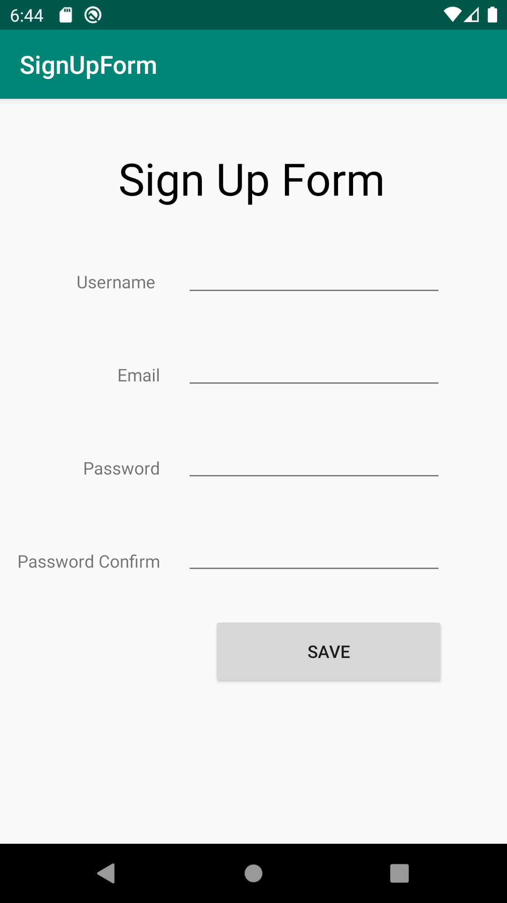
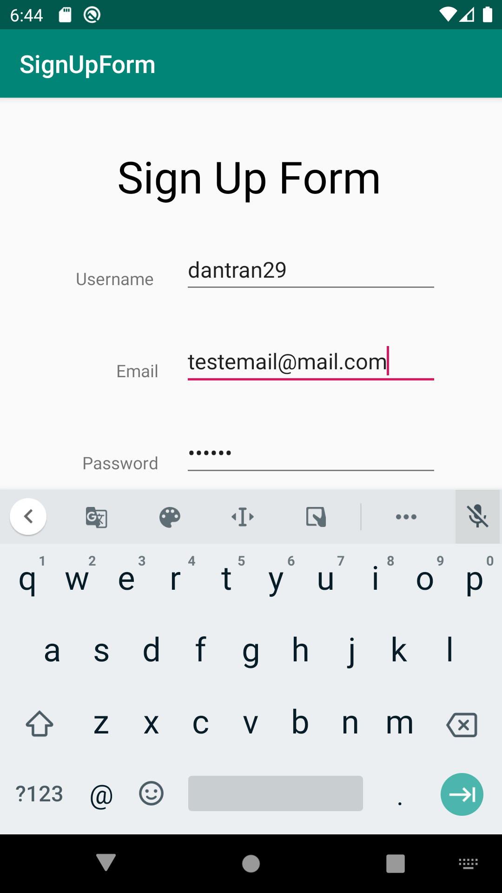
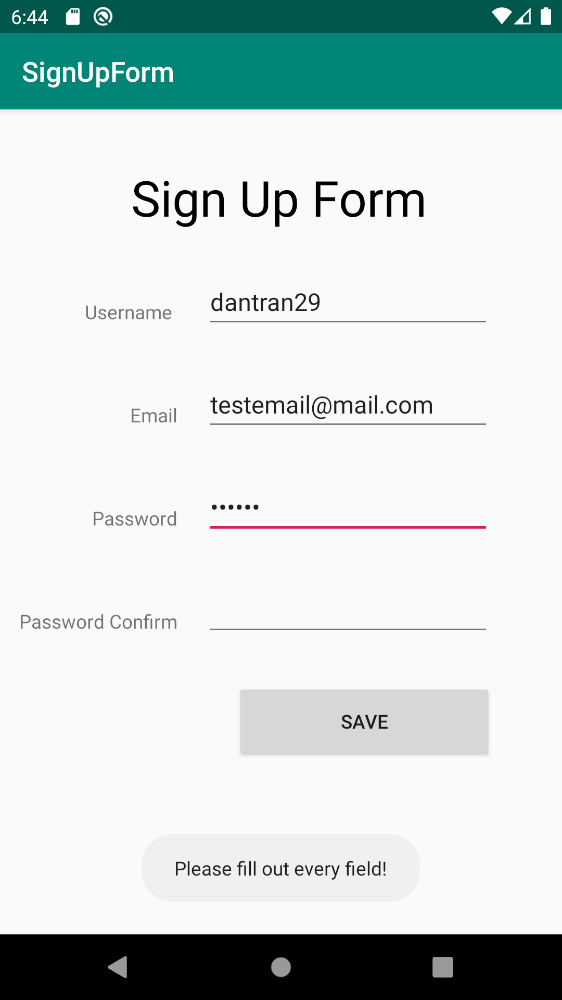
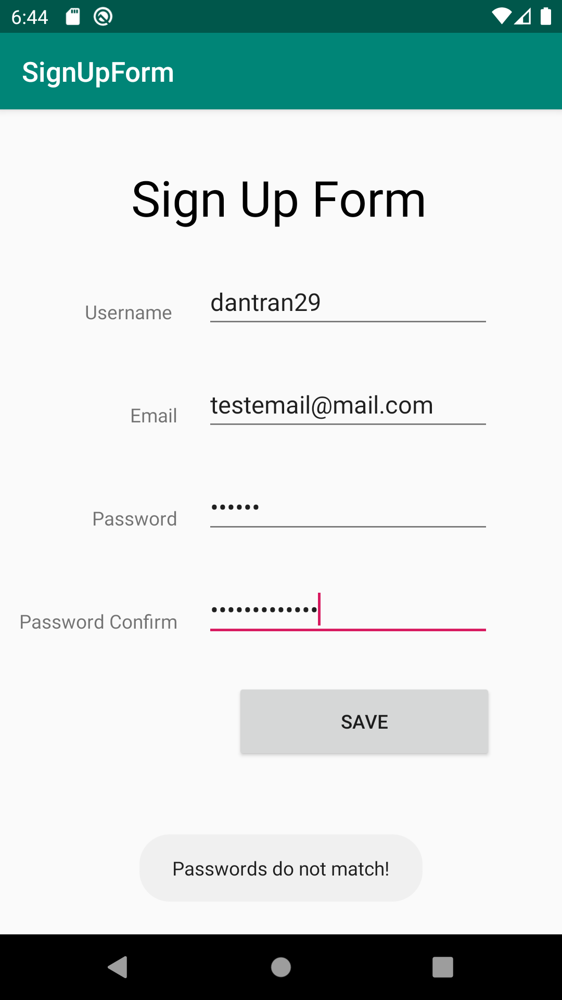

# CIS3515-001-lab2

# Dan Tran - Assignment 2 of Mobile Dev

# Description

This Android application will imitate a sign up form. The user will type inputs for four different fields:

**1. Username**

**2. Email**

**3. Password**

**4. Password Confirmation**

When the `[SAVE]` button is clicked, different things occur depending on the user input: 

* When any of the fields are empty, a Toast message will appear telling the user to fill in all the fields

* When the fields are all filled but the user did not match the two passwords, a Toast message will appear telling the user that the passwords do not match

* When all fields are filled and the passwords match, a new activity will load with a welcome message

## 

**This image shows the initial activity that loads up.**

##

**This shows that there is a `@` symbol in the keyboard. This means the email field has the correct input type. The input type for password is also correct because it shows `****`.**

##

**When any of the fields are missing this Toast pops up.**

##

**When all the fields are filled out, this Toast pops up if the passwords do not match.**

##

**When all the fields are filled out and the passwords match, this welcome activity will load with a welcome message.**

---
